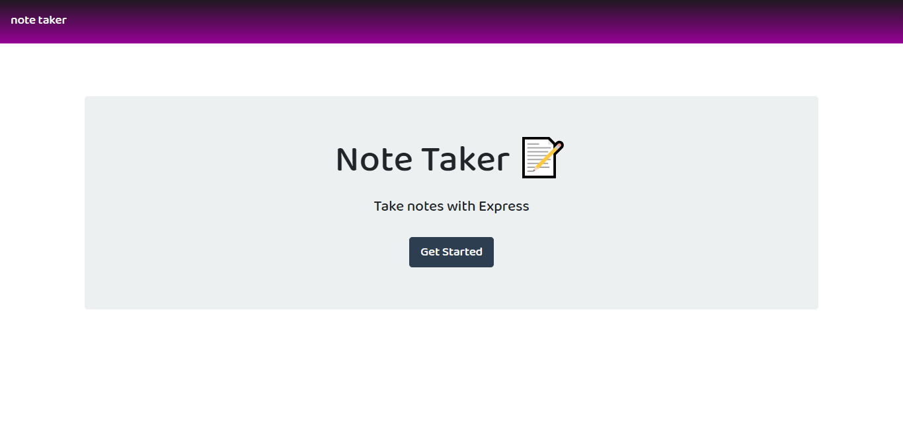
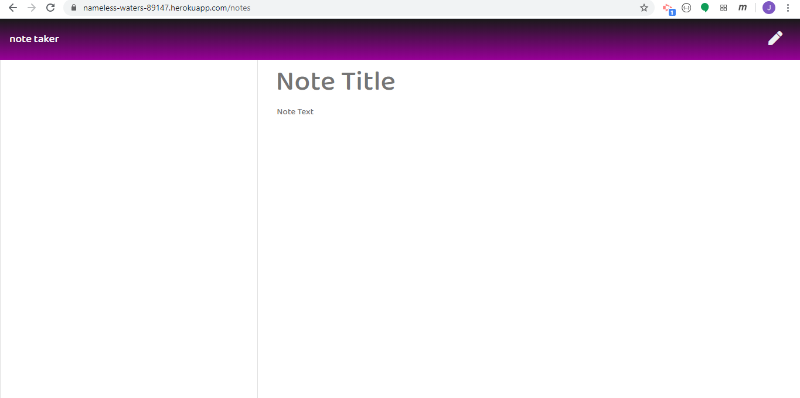
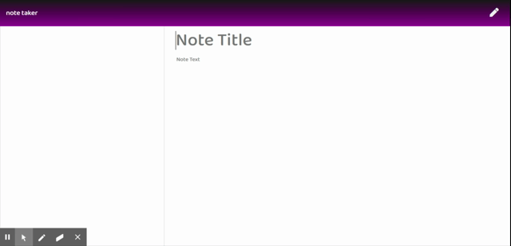

# Note Taker

This app saves notes that the user creates to a json file stored on Heroku. A link to the version deployed via Heroku can be found [here.](https://nameless-waters-89147.herokuapp.com/)  

## Table of Contents

[Introduction](#introduction)  
[Installation](#installation)  
[Usage](#usage)  
[Code](#code)
[Future Development](#future-development)
[Acknowledgements](#acknowledgements)  
[Contributing](#contributing)  
[About the Author](#about-the-author)  

## Introduction

  

This application was completed as a homework project for the Penn-Trilogy Full-Stack Coding Bootcamp. As such, the front-end code was provided to us (although I adjusted the css styling a little bit to make it visually more unique). Our task was to create a server using express.js and integrate this with the front-end index.js file to create a full-stack application that accepts data in the form of notes from the user, saves it to a json file hosted on Heroku, reads data from this file, and finally deletes specific files according to the user's input.

## Installation


There is no installation required! Simply go to the hosted page [here](https://nameless-waters-89147.herokuapp.com/).

### Dependencies

NPM dependencies include Express.js and UUID. The server also uses the Path and FS Node Standard Libraries.

## Usage


To use the application, navigate to the hosted page. Begin typing a note title and then the text of the note. Once some values are entered into each input area, you will be given the option to save the note. This is where the back-end code that I wrote comes into play! To delete a note, simply click on the trashcan icon in the saved notes section. See the "Code" section for more details on how the back-end code that I wrote works.

## Code

The code that I wrote exists in the server.js file. The challenge with this homework was to get the front-end and back-end code to "play nice." The front end code makes http requests to the back-end. These come in several varieties: GET, POST and DELETE.

The very first thing my server does is actually to use FS to read the db.json file. Many of the http requests depend upon whether or not this file exists, and what its contents are, so it seemed important for this to be loaded first. This is then parsed into an object using JSON.parse();

From there, the various routes are defined. The GET routes are straightforward: they simply send back an html file from the public directory (specified as the directory from which to send static files using ```app.use(express.static(path.join(__dirname, "public")));```).

The post route gets a little more complicated. It receives the data for the new note from the user using ```req.body```. A new property, id is then added to this object and assigned a unique value using uuidv4:  
```newNote["id"] = uuidv4();```  
From here, this object is pushed to the noteDB array of objects. noteDB is then stringified and saved to the db.json file.  

The delete route gets the unique id supplied in the url, and then uses filter to create a new array from notesDB, filtering out any instances of notes with the id property being equal to the received id. The resultant array is then once again saved to db.json.

```const id = req.params.id;``` 
```noteDB = noteDB.filter(note => note.id !== id);```  


## Future Development

My ideas for future development include requiring users to login with a username and password, and then creating a unique db for each user, with an id supplied by uuid. I also think I could add a way for users to download their notes as .txt files. Another feature I would like to add would be the ability to edit existing notes (the front-end code does not currently allow for this).

## Acknowledgements

As this was a homework assignment, the following files were prefabricated for our cohort to use:

-index.js
-styles.css (although I edited this to give the page a more unique look)
-index.html
-notes.html

## Contributing

If you notice any problems with the code, please submit a github issue. 


## About the Author

Joe Dvorak

Github: dvorakjt

Github repository: [github.com/dvorakjt](https://github.com/dvorakjt/)

Portfolio: [dvorakjt.github.io/](https://userName.github.io/)

README generated by GeneREADME. Original template written with [StackEdit](https://stackedit.io/). Badges provided through shields.io.
